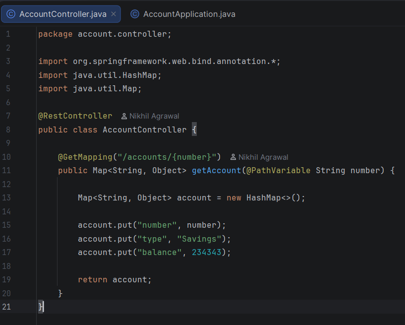
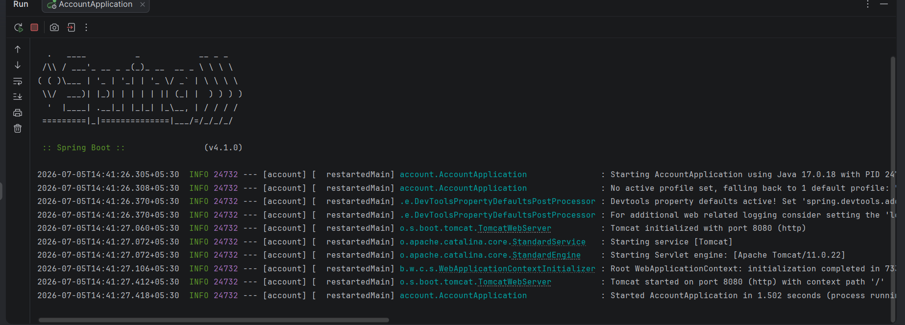

# Creating Microservices for Account and Loan

## Account Microservice

### Objective

Develop a Spring Boot REST microservice that provides account details based on the account number.

---

## Technologies Used

- Java 17
- Spring Boot
- Spring Web
- Maven

---

## Dependencies

- Spring Boot Starter Web
- Spring Boot DevTools

---

## Project Structure

```
account
│── src
│   ├── main
│   │   ├── java
│   │   │   └── account
│   │   │       ├── AccountApplication.java
│   │   │       └── controller
│   │   │           └── AccountController.java
│   │   └── resources
│   │       └── application.properties
│   └── test
│
├── pom.xml
├── README.md
└── Screenshots
```

---

## REST Endpoint

### Get Account Details

**Request**

```
GET /accounts/{number}
```

**Example**

```
http://localhost:8080/accounts/00987987973432
```

---

## Sample Response

```json
{
  "number": "00987987973432",
  "type": "Savings",
  "balance": 234343
}
```

---

## Steps Performed

1. Created a Spring Boot Maven project.
2. Added Spring Web dependency.
3. Created the `AccountController` class.
4. Implemented REST endpoint using `@GetMapping`.
5. Returned dummy account information.
6. Tested the endpoint successfully in the browser.

---

# Output Screenshots

## Project Structure


---

## AccountController



---

## Application Running



---

## Browser Output


