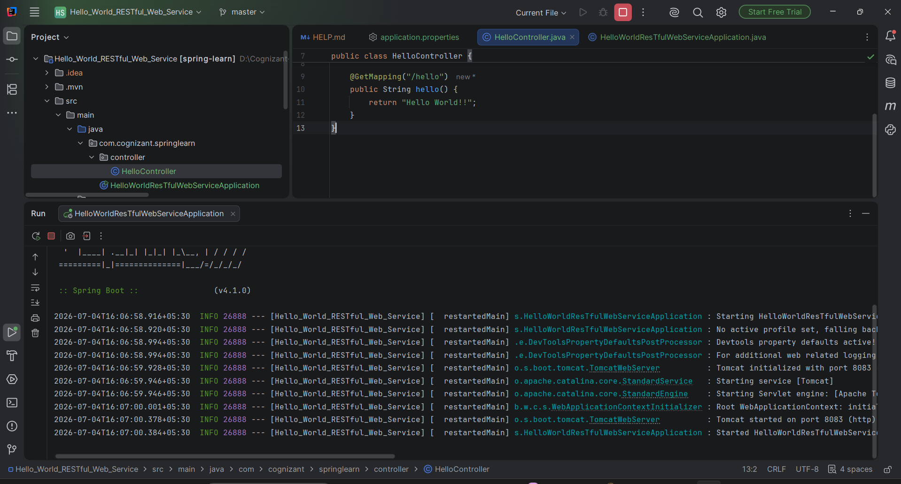

### Hello World RESTful Web Service


\## Objective


Create a simple RESTful Web Service using Spring Boot that returns \*\*"Hello World!!"\*\*.


\## Technologies Used


\- Java 17

\- Spring Boot

\- Spring Web

\- Maven


\## Project Structure


```

src

&#x20;├── main

&#x20;│   ├── java

&#x20;│   │      └── com.cognizant.springlearn

&#x20;│   │             ├── HelloWorldResTfulWebServiceApplication.java

&#x20;│   │             └── controller

&#x20;│   │                    └── HelloController.java

&#x20;│   └── resources

&#x20;│          └── application.properties

&#x20;└── test

```


\## Controller


`HelloController.java`


```java

@RestController

public class HelloController {


&#x20;   @GetMapping("/hello")

&#x20;   public String hello() {

&#x20;       return "Hello World!!";

&#x20;   }

}

```


\## Configuration


`application.properties`


```properties

server.port=8083

```


\## URL


```

http://localhost:8083/hello

```


\## Output


\### Application Running





\### Browser Output


