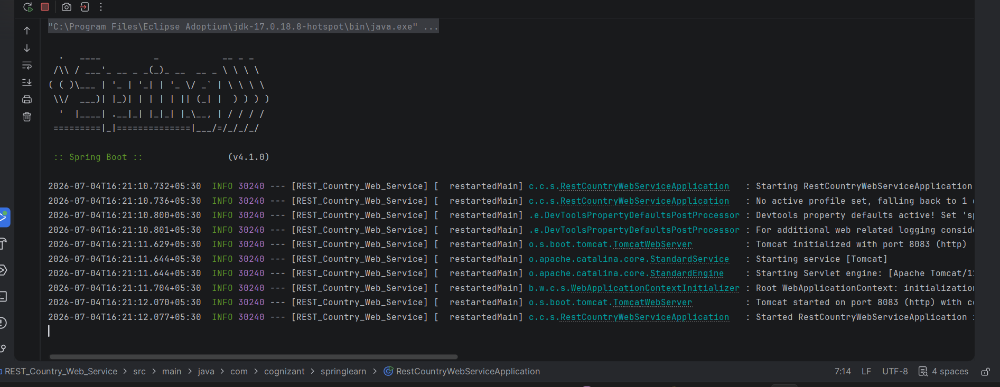

### REST Country Web Service


\## Objective


Develop a RESTful Web Service using Spring Boot that returns the details of a country loaded from a Spring XML configuration file.


\## Technologies Used


\- Java 17

\- Spring Boot

\- Spring Web

\- Spring Context

\- Maven


\## Project Structure


```

src

&#x20;├── main

&#x20;│   ├── java

&#x20;│   │      └── com.cognizant.springlearn

&#x20;│   │             ├── controller

&#x20;│   │             │      └── CountryController.java

&#x20;│   │             ├── model

&#x20;│   │             │      └── Country.java

&#x20;│   │             ├── service

&#x20;│   │             │      └── CountryService.java

&#x20;│   │             └── RestCountryWebServiceApplication.java

&#x20;│   └── resources

&#x20;│          ├── application.properties

&#x20;│          └── country.xml

&#x20;└── test

```


\## Project Description


This application exposes a REST endpoint that returns the details of a country. The country information is defined as a Spring Bean in an XML configuration file and is loaded using the Spring Application Context.


\## XML Configuration


The `country.xml` file defines the Country bean.


```xml

<bean id="country" class="com.cognizant.springlearn.model.Country">

&#x20;   <property name="code" value="IN"/>

&#x20;   <property name="name" value="India"/>

</bean>

```


\## REST Endpoint


| Method | URL | Description |

|--------|-----|-------------|

| GET | `/country` | Returns the Country object |


\## URL


```

http://localhost:8083/country

```


\## Expected Output


```json

{

&#x20; "code": "IN",

&#x20; "name": "India"

}

```


\## Application Configuration


`application.properties`


```properties

server.port=8083

```


\## Output Screenshots


\### Application Running





\### Browser / Postman Output


