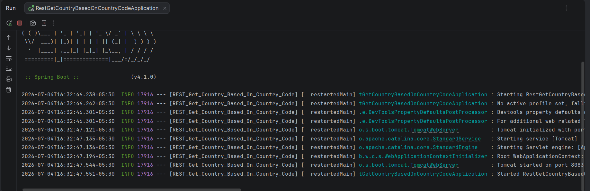

### REST Get Country Based on Country Code


\## Objective


Develop a RESTful Web Service using Spring Boot that returns the details of a country based on the country code provided in the URL.


\## Technologies Used


\- Java 17

\- Spring Boot

\- Spring Web

\- Maven


\## Project Structure


```

src

&#x20;├── main

&#x20;│   ├── java

&#x20;│   │      └── com.cognizant.springlearn

&#x20;│   │             ├── controller

&#x20;│   │             │      └── CountryController.java

&#x20;│   │             ├── model

&#x20;│   │             │      └── Country.java

&#x20;│   │             ├── service

&#x20;│   │             │      └── CountryService.java

&#x20;│   │             └── RestGetCountryBasedOnCountryCodeApplication.java

&#x20;│   └── resources

&#x20;│          └── application.properties

&#x20;└── test

```


\## Project Description


This application exposes a REST endpoint that accepts a country code as a path variable and returns the corresponding country details. The service performs a case-insensitive search and returns the matching country object.


\## REST Endpoint


| Method | URL | Description |

|--------|-----|-------------|

| GET | `/countries/{code}` | Returns country details based on the country code |


\## URL


```

http://localhost:8083/countries/in

```


or


```

http://localhost:8083/countries/us

```


\## Expected Output


For:


```

http://localhost:8083/countries/in

```


Response:


```json

{

&#x20; "code": "IN",

&#x20; "name": "India"

}

```


For:


```

http://localhost:8083/countries/us

```


Response:


```json

{

&#x20; "code": "US",

&#x20; "name": "United States"

}

```


\## Application Configuration


`application.properties`


```properties

server.port=8083

```


\## How to Run


1\. Open the project in IntelliJ IDEA.

2\. Wait for Maven dependencies to download.

3\. Run `RestGetCountryBasedOnCountryCodeApplication`.

4\. Open a browser or Postman.

5\. Access:


```

http://localhost:8083/countries/in

```


\## Output Screenshots


\### Application Running





\### Browser


